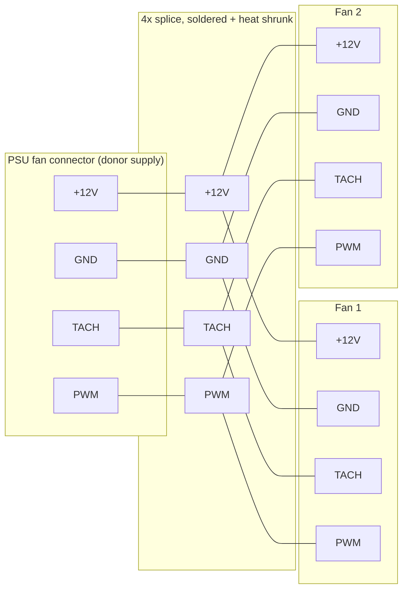

A [Hack Club](https://hackclub.com) [Macondo](https://macondo.hackclub.com) project

# Supermicro 40mm Fan Swap

[Onshape](https://cad.onshape.com/documents/373ffd8f172fee48bdac2120/w/7900feb72fc626060cd19447/e/43b79a1c3cb5936e74e0c8c3?renderMode=0&uiState=6a223409dba78bde51dcc5cb) | [Macondo](https://macondo.hackclub.com) | [BOM](https://github.com/kailingma/supermicro-40mm-fan-swap/blob/main/BOM.csv) | [STEP](https://github.com/kailingma/supermicro-40mm-fan-swap/blob/main/Noctua%2040mm%20Fan%20Spacer.step)

## What and why

My 2U Supermicro server is loud, and the worst offender is the fan in its 1U power supply. This project yanks that fan out and replaces it with two Noctua 40mm fans on a 3D-printed adapter that fits the original opening. Same airflow, way less noise.

## How it fits together

The fans bolt onto the adapter 15mm apart. Funny enough, 15mm is the textbook gap for a 120mm fan, so at 40mm scale it's about three times the ideal spacing, which means the airflow from the first fan evens out before it hits the second one. The adapter drops straight into the PSU housing where the original fan lived.

The electrical side is where the real work is. The original fan cable was cut out, the connector is spared from a donor power supply, and everything is joined with Western Union splices, soldered, and heat shrunk.

## Parts

- 1U Supermicro power supply (from a 2U server)
- 2x Noctua 40mm fans, with the splitter cable they ship with
- 3D-printed adapter (second prototype)
- Wire, solder, hot glue, heat shrink

## Images

|  |  |
|-------|--------|
| Final Wiring | Western Union Splice |
|  | 
| Soldering Job | Fan Comparison |

## Wiring Diagram

## Build log

1. **Modelling (Jun 4):** measured the fans, settled on wall thickness, printed two prototypes. Also learned that my 15mm gap is the textbook spacing for a 120mm fan, so at 40mm scale the airflow evens out nicely between the two fans.
2. **Soldering (Jun 5):** first time trying the Western Union splice, on tiny AWG 24 and 22 wires. They came out clean, though I picked the wrong heat shrink size for the first one and forgot it entirely, so it's a bit ugly.
3. **Final wiring and test (Jul 27):** everything soldered, shrink wrapped, and assembled. On power-up the fans spin for a moment and the PSU shuts itself off.

## Result

I never got a successful test. The fans spin up briefly, then the power supply trips its overcurrent protection and shuts off, a fault the donor supply has had for years. Most likely the donor fan cabling was defective from the start, and it's possible the PWM and TACH wires were pinned wrong too. Without a known-good supply I couldn't isolate which one.

The wiring itself is solid and the adapter fits. If I pick this back up, the next step is checking the pinout against the supply and testing with cables from a known good power supply.
